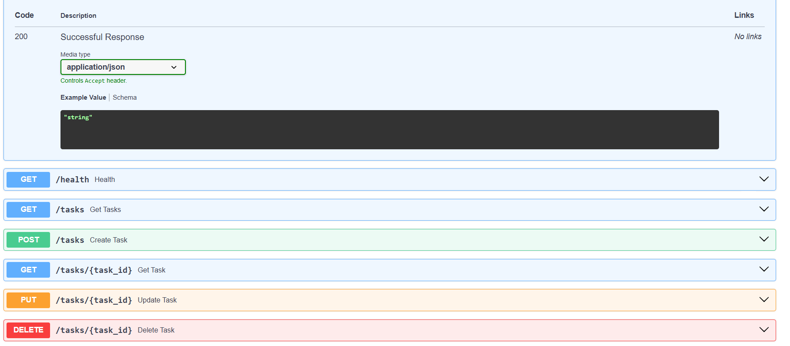

Run the application:

```bash
uvicorn main:app --reload
```

## API Documentation

Swagger UI:

```
http://127.0.0.1:8000/docs
```

## Endpoints

| Method | Endpoint | Description |
|--------|----------|-------------|
| GET | / | API Information |
| GET | /health | Health Check |
| GET | /tasks | Get All Tasks |
| GET | /tasks/{task_id} | Get Task by ID |
| POST | /tasks | Create Task |
| PUT | /tasks/{task_id} | Update Task |
| DELETE | /tasks/{task_id} | Delete Task |

## Sample cURL

```bash
curl -i http://127.0.0.1:8000/tasks
```

## Output

```
HTTP/1.1 200 OK
Content-Type: application/json
```

## Swagger Screenshot

