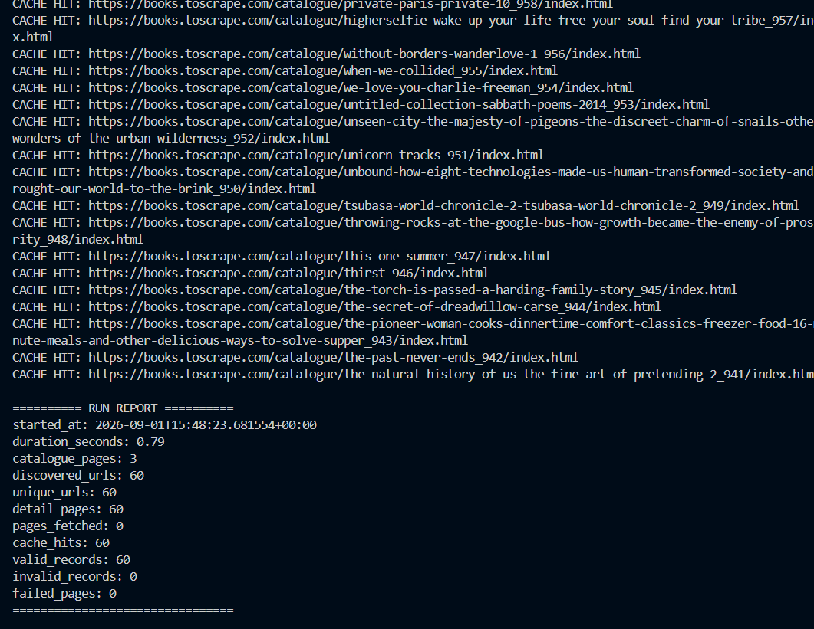

# Books to Scrape — Polite Scraper

A small Python web-scraping pipeline built for the FlyRank Backend Internship.


## Target Classification

The target is Books to Scrape:

https://books.toscrape.com/

Books to Scrape is a public sandbox created for practicing web scraping.

This scraper processes only the first three catalogue pages and discovers the
60 books listed there.

I will not reuse this code on another site without checking its rules and
terms first.

## Tech Stack

- Python
- Requests
- BeautifulSoup
- Pydantic

## Pipeline

Fetch → Cache → Discover → Extract → Normalize → Validate → Store → Report

## Data Collected

Each book contains:

- title
- product_url
- price_text
- price_gbp
- availability_text
- rating_text
- description
- source_page
- fetched_at

## Politeness

The scraper:

- identifies itself with a User-Agent
- uses a 10 second timeout
- waits at least 500ms between real requests
- checks HTTP status codes
- caches downloaded pages
- uses cached pages during development

## Validation

Scraped records are validated using Pydantic.

Invalid records are written to:

output/errors.json

Valid records are written to:

output/books.json

## Run

Install dependencies:

```bash
pip install -r requirements.txt